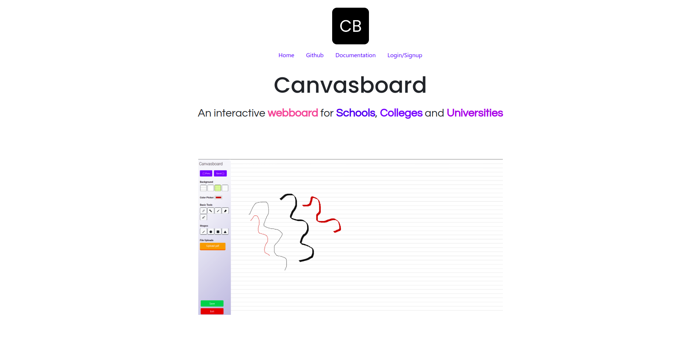

<p align="center">
  <a href="https://github.com/goliakshay357/covid19-dashboard">
    
  </a>

  <h3 align="center">Canvasboard</h3>

  <p align="center">
    An Interactive Webboard for Schools, Colleges and Universities. 
    <br />
    <a href="https://github.com/Canvasbird/canvasboard/"><strong>Explore the docs »</strong></a>
    <br />
    <a href="https://github.com/Canvasbird/canvasboard/issues">Report Bug</a>
    .
    <a href="https://github.com/Canvasbird/canvasboard/issues">Request Feature</a>
    .
    <a href="https://gitter.im/canvasbird/canvasboard-frontend">IRC Channel</a>
  
  </p>
</p>
</br>

## Project Overview:

 > <strong>The whole purpose of education is to turn mirrors into windows.<br>- Sydney J. Harris</strong>

An interactive webboard application built on Angular to excel learning experience in schools,Colleges and Universities. Our main goal is to create a standalone web application which simplifies the prepping,in-class teaching and learning experience for its users (Teachers, Students).



## Dependencies🗃:
- [Angular]
- [Bootstrap]
- [jQuery]
- [Nodejs with express]
- [Firebase]

## Running the canvasboard application:
Make sure NodeJS and Angular CLI is installed locally in your system.
To verify NodeJS is installed, type the following command to check the node version
```bash
node -v
```
To verify NPM version is installed, type the following command to check the npm version
```bash
npm -v
```

## How to set up locally💻:
1. Clone the repository from GitHub and cd into the directory
```bash
git clone "https://github.com/Canvasbird/canvasboard.git"
cd canvasboard
```
2. Install node modules ( Make sure you are in the root directory )
```bash
npm install
```
3. Once node modules are installed, Serve the application locally with polling value 2000
```bash
ng serve -o --poll=2000
```

Yayy! Your application is served locally in localhost:4200

## Contributing🤝 
#### Please consider contributing to the project, with your ideas, your artwork, and your code.
1. Fork it!
2. Create your branch: git checkout -b branch-name
3. Commit your changes: git commit -am 'Add some feature or solve bug'
4. Push to the branch: git push origin branch-name
### Submit a pull request :D

[Angular]:<https://angular.io/>
[Bootstrap]:<https://getbootstrap.com/>
[jQuery]:<https://jquery.com/>
[Nodejs with express]:<https://expressjs.com/>
[Firebase]:<https://firebase.google.com/>

